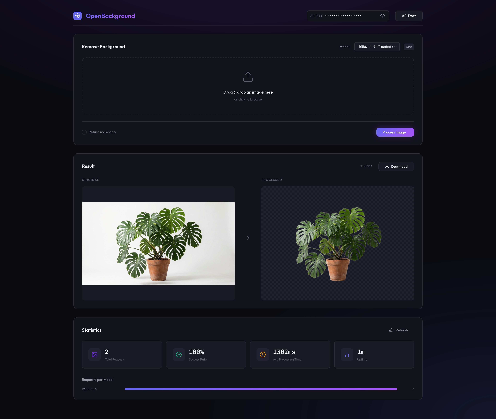

# OpenBackground

A self-hosted background removal microservice using Hugging Face image segmentation models. Deploy as a Docker container and integrate with your existing services via REST API.



## Features

- **Multiple Models**: Works with Hugging Face image segmentation models that use `AutoModelForImageSegmentation`
- **REST API**: Simple HTTP API for integration with any service
- **Web Dashboard**: Built-in UI for testing and monitoring
- **Docker Ready**: CPU and GPU Docker images available
- **Statistics**: Track usage, processing times, and success rates
- **API Key Auth**: Secure your deployment with API key authentication

## Compatible Models

This service works with Hugging Face image segmentation models. You can use any model compatible with the `transformers` library's `AutoModelForImageSegmentation` class. 

To find compatible models, search on [Hugging Face Hub](https://huggingface.co/models?pipeline_tag=image-segmentation) for image segmentation models.

**Important:** Always check the license of any model you use. Some models are only available for non-commercial use and require a separate license for commercial applications.

## Quick Start

### Using Docker (Recommended)

**CPU Version:**
```bash
# Clone the repository
git clone https://github.com/yourusername/openbackground.git
cd openbackground

# Create .env file
cp .env.example .env
# Edit .env and set your API_KEYS and MODEL configuration

# Start with Docker Compose (CPU)
cd docker
docker-compose --profile cpu up -d
```

**GPU Version (requires NVIDIA Container Toolkit):**
```bash
cd docker
docker-compose --profile gpu up -d
```

The service will be available at `http://localhost:8000`

### Manual Installation

```bash
# Clone and enter directory
git clone https://github.com/yourusername/openbackground.git
cd openbackground

# Create virtual environment
python -m venv venv
source venv/bin/activate  # On Windows: venv\Scripts\activate

# Install dependencies
cd backend
pip install -r requirements.txt

# For CPU-only PyTorch (smaller download):
pip install torch torchvision --index-url https://download.pytorch.org/whl/cpu

# Create .env file
cp ../.env.example .env

# Run the server
python -m uvicorn app.main:app --reload
```

## Configuration

Create a `.env` file in the project root (or backend directory for manual installation):

```env
# Required: API keys for authentication
API_KEYS=your-secret-key-1,your-secret-key-2

# Model configuration - set to your preferred Hugging Face model
DEFAULT_MODEL=your-model/name
AVAILABLE_MODELS=your-model/name,another-model/name
MODEL_CACHE_DIR=./models

# Processing limits
MAX_IMAGE_SIZE=4096

# Optional: Enable statistics persistence
ENABLE_STATS_PERSISTENCE=false
STATS_DB_PATH=./data/stats.db
```

## API Reference

### Authentication

All endpoints (except `/api/v1/health`) require an API key in the `X-API-Key` header:

```bash
curl -H "X-API-Key: your-api-key" http://localhost:8000/api/v1/models
```

### Endpoints

#### Health Check
```http
GET /api/v1/health
```
Returns service health status. No authentication required.

#### Remove Background
```http
POST /api/v1/remove-background
Content-Type: multipart/form-data

file: <image file>
model: model-name (optional, uses default if not specified)
return_mask: false (optional)
```

Returns PNG image with transparent background.

**Example:**
```bash
curl -X POST \
  -H "X-API-Key: your-api-key" \
  -F "file=@photo.jpg" \
  http://localhost:8000/api/v1/remove-background \
  --output result.png
```

#### Remove Background (Base64)
```http
POST /api/v1/remove-background/base64
```
Same parameters as above, returns JSON with base64-encoded image.

#### List Models
```http
GET /api/v1/models
```
Returns available models and their status.

#### Load Model
```http
POST /api/v1/models/load
Content-Type: application/json

{"model_name": "your-model/name"}
```

#### Get Statistics
```http
GET /api/v1/stats
```
Returns processing statistics.

### Response Headers

The remove-background endpoint includes useful metadata in response headers:
- `X-Processing-Time-Ms`: Processing time in milliseconds
- `X-Model-Used`: Model used for processing
- `X-Original-Width`: Original image width
- `X-Original-Height`: Original image height

## Web Dashboard

Access the web dashboard at `http://localhost:8000/`. Features:
- Drag & drop image upload
- Model selection
- Side-by-side preview (original vs processed)
- Download processed images
- Real-time statistics

## Integration Examples

### Python
```python
import requests

API_URL = "http://localhost:8000/api/v1/remove-background"
API_KEY = "your-api-key"

with open("input.jpg", "rb") as f:
    response = requests.post(
        API_URL,
        headers={"X-API-Key": API_KEY},
        files={"file": f}
    )

with open("output.png", "wb") as f:
    f.write(response.content)
```

### JavaScript/Node.js
```javascript
const FormData = require('form-data');
const fs = require('fs');
const fetch = require('node-fetch');

const form = new FormData();
form.append('file', fs.createReadStream('input.jpg'));

const response = await fetch('http://localhost:8000/api/v1/remove-background', {
    method: 'POST',
    headers: { 'X-API-Key': 'your-api-key' },
    body: form
});

const buffer = await response.buffer();
fs.writeFileSync('output.png', buffer);
```

### cURL
```bash
curl -X POST \
  -H "X-API-Key: your-api-key" \
  -F "file=@input.jpg" \
  -F "return_mask=false" \
  http://localhost:8000/api/v1/remove-background \
  -o output.png
```

## Performance

| Configuration | Avg Processing Time | Memory Usage |
|--------------|---------------------|--------------|
| CPU (8 cores) | ~2-5 seconds | ~4GB RAM |
| GPU (modern) | ~200-500ms | ~2GB VRAM |

*Performance varies depending on the model used and image size.*

## Deployment

### Docker Volumes

The Docker setup uses named volumes for persistence:
- `openbackground-models`: Cached model files (~500MB-1GB per model)
- `openbackground-stats`: Statistics database (if enabled)

### Scaling

For production deployments:
1. Use the GPU image for better performance
2. Set multiple workers: `WORKERS=4`
3. Place behind a reverse proxy (nginx) for SSL
4. Use container orchestration (Kubernetes, Docker Swarm) for horizontal scaling

### Resource Requirements

**Minimum:**
- CPU: 4 cores
- RAM: 8GB
- Storage: 10GB (for models)

**Recommended:**
- CPU: 8+ cores OR NVIDIA GPU
- RAM: 16GB
- Storage: 20GB SSD

## API Documentation

Interactive API documentation is available at:
- Swagger UI: `http://localhost:8000/api/docs`
- ReDoc: `http://localhost:8000/api/redoc`

## Troubleshooting

### Model fails to load
- Ensure you have enough RAM/VRAM
- Check network connectivity for model download
- Verify model name is in `AVAILABLE_MODELS`
- Confirm the model is compatible with `AutoModelForImageSegmentation`

### Slow processing
- Consider using GPU version
- Reduce `MAX_IMAGE_SIZE` if processing large images
- Ensure models are cached (first run downloads them)

### API key issues
- Check `API_KEYS` environment variable is set
- Ensure no extra whitespace in keys
- Verify header name is exactly `X-API-Key`

## Contributing

Contributions are welcome! Please:
1. Fork the repository
2. Create a feature branch
3. Submit a pull request

## License

This project is MIT licensed. See [LICENSE](LICENSE) for details.

**Important:** Hugging Face models have their own licenses. Always verify the license terms of any model you use, especially for commercial applications.

## Acknowledgments

- [Hugging Face](https://huggingface.co/) for model hosting and the transformers library
- [FastAPI](https://fastapi.tiangolo.com/) for the web framework
